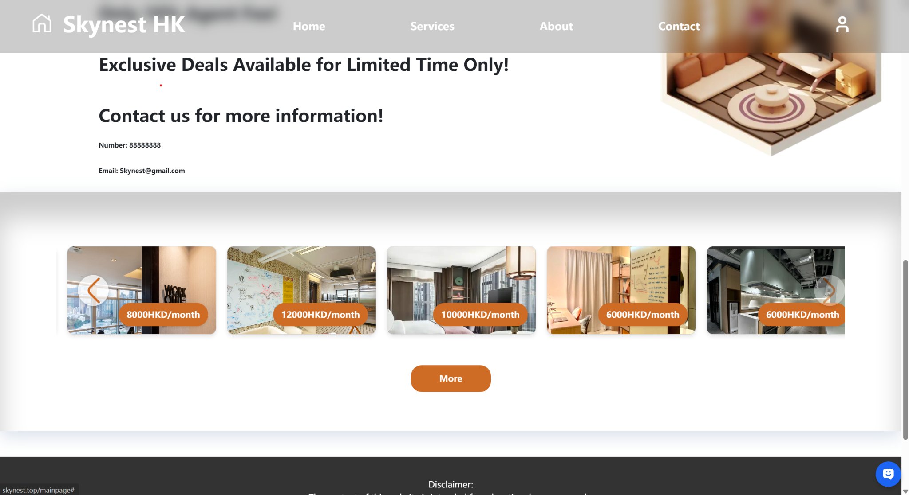
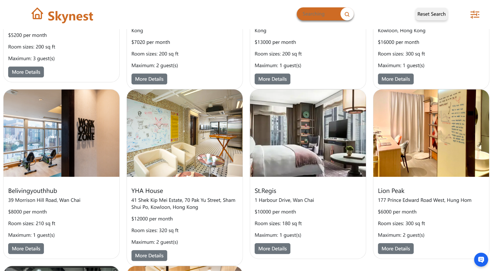
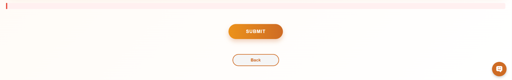
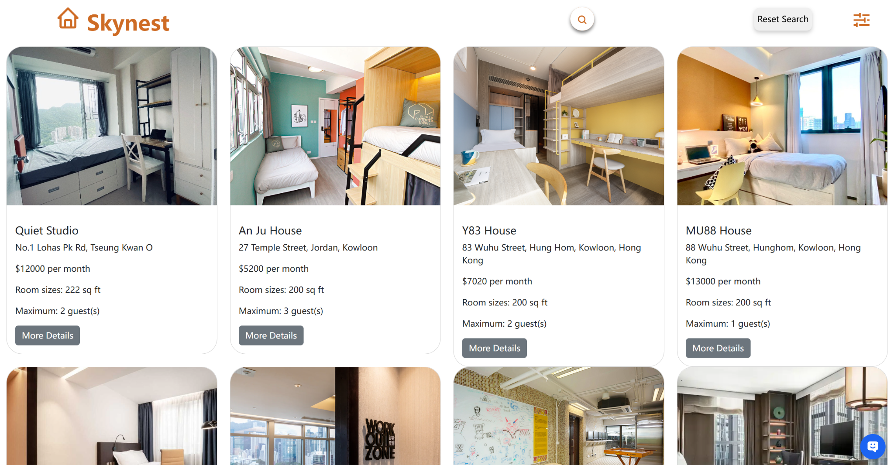

# “Online Rental House SkyNest Platform” 

# Table of Contents

[1. Executive Summary [3](#executive-summary)](#executive-summary)

[2. Background [4](#background)](#background)

[3. Aims and Objectives [4](#aims-and-objectives)](#aims-and-objectives)

[4. Literature Review [5](#literature-review)](#literature-review)

[5. Approach [7](#approach)](#approach)

[6. The Outcome of the Project
[7](#the-outcome-of-the-project)](#the-outcome-of-the-project)

[a.Prototype description
[7](#a.prototype-description)](#a.prototype-description)

[1. The structure of the whole database
[7](#the-structure-of-the-whole-database)](#the-structure-of-the-whole-database)

[2. The first page in Skynest HK as advertisement
[9](#the-first-page-in-skynest-hk-as-advertisement)](#the-first-page-in-skynest-hk-as-advertisement)

[3. Login function [10](#login-function)](#login-function)

[4.Forgotten password page
[12](#forgotten-password-page)](#forgotten-password-page)

[5. The page of creating a new account
[13](#the-page-of-creating-a-new-account)](#the-page-of-creating-a-new-account)

[6. The managing cookie
[13](#the-managing-cookie)](#the-managing-cookie)

[7. The main page of Skynest HK
[14](#the-main-page-of-skynest-hk)](#the-main-page-of-skynest-hk)

[8. 404 not Found page [17](#not-found-page)](#not-found-page)

[9. Posting page [18](#posting-page)](#posting-page)

[10. The payment for landlords’ agency
[19](#the-payment-for-landlords-agency)](#the-payment-for-landlords-agency)

[11. Rental page [20](#rental-page)](#rental-page)

[12. The specific housing resource page
[22](#the-specific-housing-resource-page)](#the-specific-housing-resource-page)

[13. Payment page for customers to book
[27](#payment-page-for-customers-to-book)](#payment-page-for-customers-to-book)

[14. My page [28](#my-page)](#my-page)

[15. Scoring page [32](#scoring-page)](#scoring-page)

[16. AI chat box [34](#ai-chat-box)](#ai-chat-box)

[17. The chat box between landlords and tenants
[34](#the-chat-box-between-landlords-and-tenants)](#the-chat-box-between-landlords-and-tenants)

[18. Logo icon [35](#logo-icon)](#logo-icon)

[b.Prototype performance against the objectives
[36](#b.prototype-performance-against-the-objectives)](#b.prototype-performance-against-the-objectives)

[1. Centralized Housing Information Database
[36](#centralized-housing-information-database)](#centralized-housing-information-database)

[2. Real-time Availability and Instant Booking
[37](#real-time-availability-and-instant-booking)](#real-time-availability-and-instant-booking)

[3. User Account Functionality
[37](#user-account-functionality)](#user-account-functionality)

[4. Customer Reviews and Ratings
[37](#customer-reviews-and-ratings)](#customer-reviews-and-ratings)

[5. Mobile-friendly and Responsive Design
[37](#mobile-friendly-and-responsive-design)](#mobile-friendly-and-responsive-design)

[6. Customer Support and AI Assistance
[38](#customer-support-and-ai-assistance)](#customer-support-and-ai-assistance)

[c.Testing with actual data
[38](#c.testing-with-actual-data)](#c.testing-with-actual-data)

[1.Testing with normal data
[38](#testing-with-normal-data)](#testing-with-normal-data)

[2. Testing with abnormal data
[41](#testing-with-abnormal-data)](#testing-with-abnormal-data)

[d.Problems faced and how to resolve the problems
[44](#d.problems-faced-and-how-to-resolve-the-problems)](#d.problems-faced-and-how-to-resolve-the-problems)

[1. 500 Post Internal Error
[44](#post-internal-error)](#post-internal-error)

[2. 404 page not found
[45](#page-not-found)](#page-not-found)

[3. 400 Bad Request Error
[45](#bad-request-error)](#bad-request-error)

[7. User Guides [46](#user-guides)](#user-guides)

[8. Project Actual Process Against the Project Schedule
[55](#project-actual-process-against-the-project-schedule)](#project-actual-process-against-the-project-schedule)

[9. Discussion and Recommendation
[56](#discussion-and-recommendation)](#discussion-and-recommendation)

[10. Conclusion [57](#conclusion)](#conclusion)

[11. Reference [59](#reference)](#reference)

# 1. Executive Summary

The “SkyNest” project is to develop a front-end and back-end stack
online rental housing platform and provide real-time updated house
resources. Especially in high-spending areas, the traditional way of
rental housing would cause more middle-outcome, time-consuming, and
inefficient processes, which became more problematic during the
pandemic. “SkyNest” mitigates these difficulties by providing a digital
solution that improves user experience regarding accessibility and
transparency for both buyers and landlords.

The site "SkyNest" offers a contemporary, intuitive interface that
provides real-time housing availability, real-time booking, and
comprehensive property listings. After the provided information on the
platform, the filters function could help users to find what they
specifically needed, such as whether the house would provide Wi-Fi. Does
the house include a smoking area? And even selection for people to
choose from. In the user account section, users are allowed to register
passwords and recovery accounts, with a personal dashboard for the
management of bookings and preferences after logging in to the account.
Simultaneously, it integrates community-driven functionalities, such as
commenting and rating, which assist users in making educated choices.

In addition with the objective of targeting the enhanced user-friendly
interface, there is also a 24/7 customer support tool with AI assistance
to help for the rental housing steps. Overall, the project “SkyNest”
would modernize the rental experience for users. Compared with the
existing website for rental housing, it would be more interesting to
book the housing, and a reliable solution for renters and landlords
alike.

# 2. Background

The project aims to create an online rental housing platform to enhance
renter efficiency, streamline the booking process, and provide
convenience. The traditional approach to house renting involves using
specialized house agents, newspapers, or other offline advertisements to
find available houses, which can be time-consuming and physically
demanding due to the need to walk outside. Following the pandemic,
individuals were subjected to quarantine restrictions for nearly two
years, during which they refrained from working in corporate
environments and experienced a declining economy. Students studying
abroad faced challenges in securing accommodation, as dormitory
applications proved difficult. Consequently, rental housing has emerged
as a predominant consumption pattern for those in need, allowing
landlords to reap significant advantages from them. Particularly for a
city that primarily produces revenue through non-local residents, it is
essential to enhance living housing services, such as by utilizing the
online booking house platform.

This project will utilize Hong Kong as a tourist place for the
demonstration city to illustrate the booking system because the housing
resources are challenging to find, and identifying the best applicable
site is also challenging. Therefore, applying the online platform for
renting houses could present multiple aspects of beneficial objectives:
collecting data about houses, searching and filtering the requirements,
providing real-time updates, and displaying price transparency while
minimizing disputes. As with the benefits above, further advantages will
be discovered in subsequent designs, rendering travel more adaptable and
convenient.

The conventional approach to locating housing necessitates considerable
time and physical exertion, as it requires navigating outdoors and
solving the challenges of housing resource issues presently faced in
Hong Kong. The "SkyNest" idea can address the aforementioned issue and
offers numerous advantages to facilitate its resolution.

# 3. Aims and Objectives

The online rental housing platform is titled “SkyNest”; it encompasses
front-end and back-end development, constituting a full-stack web
application. Additional functionalities included database management and
user identity verification. Modernized UI design to construct a
specialized and comfortable brand image, featuring a city sightseeing
backdrop with the system title to highlight regional characteristics.
The "Explore More" button is positioned at the lower part of the page; a
simpler interface enhances the customer experience. “Find House. Share
House. All in One Place” serves as the motto to illustrate the primary
target of its system functionality. The services page offers information
on a diverse cost range of HK\$ 8000 to HK\$ 100,000 each month, with a
significant proportion of listings discounted for the agent fees on the
website, and exclusive discounts from the landlords may be accessible at
certain times. On the User account system page, users can sign in with a
new account by entering their name, email, and password; moreover, an
account verification feature may be implemented, such as sending a code
to the email to confirm its validity. To access their account, users
must input their email and password in the login system. Additionally, a
“Forget Password” option is available at the bottom of this page,
allowing users to change their password by entering the multi-factor
verification code supplied by the system. The priority aim of this
project is to develop an online rental housing platform to boost rental
efficiency, facilitate straightforward reservations for customers, and
offer a seamless booking experience.

To achieve the stated aims, this platform will have six objectives.
Firstly, it features a centralized housing information database,
including essential details such as the house names, locations, and
contact numbers for the landlords, and the available amenities, such as
gyms and swimming pools, along with pricing information for the
customers. Secondly, the system will provide real-time availability and
facilitate instant booking, thereby displaying current room availability
and allowing the user to make instant bookings, which also avoids
overbooking difficulties. Thirdly, the platform provides user account
functionality, which includes live information in user accounts, like
favorite houses and past and upcoming bookings. Furthermore, utilizing
their user account will safeguard their information and privacy. The
fourth objective is customer reviews and ratings. After staying at the
house, guests can provide their feedback and ratings based on their
living experience. Besides, the given comments and ratings enable future
travelers to determine whether to select the house for their
accommodation. The fifth objective of the system is its mobile-friendly
and responsive design for accessibility on PCs and tablets, hence
enhancing user experience when device alternative options are limited.
Finally, if time allows, there will also be customer support and AI
assistance 24/7 available for live chat, email, and phone support, as
well as an automated help desk with function cancellations, refunds, and
booking modifications.

# 4. Literature Review

The website of “squarefoot” (*Squarefoot -Hong Kong Property for Sale
and Rent*, n.d.) presents a white background upon entry, featuring its
logo in the top left corner along with headers for Language, Login,
Register, and Change at the top. The navigation bar offers additional
options: Home, Buy, Rent, Service Apartment, New Homes, Estate, Office,
Mortgage, News, School Net, Agency, Eva Property Index, and Home
Moments. The subsequent layer features the search panel prominently
positioned at the center of the homepage for property inquiries, with
filter options encompassing District, Price Range, Property Type, and
Bedrooms. The third layer contains the property listings. The web page
adjusts to various screen sizes, presenting attributes in a clear grid
listing format after zooming in and out. Each property has its specific
price, dimensions, and essential characteristics, such as the number of
bedrooms and bathrooms. A concise description, such as “Sea View” or
“Near School,” is also displayed beneath the housing photograph and with
additional details, like discounted prices, number of units, and
completion dates. Various colors of purpose labels, including "For Sale"
and "For Lease," are employed to distinctly differentiate between sale
and rental properties, with the "Brand New" designation serving as the
focal point. The fourth layer is dedicated to updating visitors about
real estate market trends and new project launches, featuring a daily
article with a headline and concise summaries for efficient reading.

Despite the demonstration of “square foot”, there are remaining
deficiencies that can be addressed in the development of the project
“SkyNest.” First, the project “SkyNest” rental housing website has been
enhanced with a completely adorned city view theme, elevating its
sumptuous appearance and capturing visitors’ attention, thereby
conveying the project’s emphasis on exclusivity and quality housing. The
first initial captivates visitors’ attention and includes a singular
action button, "Explore More," facilitating seamless navigation through
the rental housing procedure. In contrast to “Squarefoot,” the “square
foot” webpage presents an overwhelming amount of information
simultaneously, which may hinder user comprehension. Furthermore, the
“SkyNest” project specifically targets luxury properties, aiming to
cultivate an aspirational lifestyle image that evokes feelings rather
than relying solely on textual content. The user interface design
prioritizes imagery and experiential engagement, ensuring that “SkyNest”
is optimized for the presentation of a singular project rather than
multiple properties. The evidence indicates that "Squarefoot" serves as
a diverse marketplace, but the "Skynest" project specifically targets
clients seeking rental accommodation.

Nevertheless, the project “SkyNest” did not demonstrate optimal
functionality, and numerous aspects of the website can be enhanced in
the further development phase. Ding et al. (2023) assert that with the
emergence of technologies such as machine learning and artificial
intelligence, the developer can advance the project “SkyNest” to enhance
the user experience through design and technological innovations,
aligning with the aim and objectives of project “SkyNest” to deliver
high-quality user experiences and a streamlined rental housing booking
method.

Another special function of “SkyNest” is AI chatting manipulation. When
the customer has a specific query about housing, the ability of the AI
chatbot could be helpful in providing the information that the customer
needs. Compared to the “Squarefoot,” the website only provides a huge
amount of information for the customer to find out about, but without a
search function for specific details, it would be confusing for
customers to search.

# 5. Approach

The survey has approached students and various age groups, with the
declared aim and objectives of the project "SkyNest" to increase user
experience and meet diverse customer expectations. 50 students are
invited to share their ideas and requirements regarding the use of
rental housing websites. 58% of respondents are current students
residing with their parents, indicating a potentially limited interest
in renting a house. Nonetheless, various individuals provided their
opinions on the necessities associated with rental housing applications.

A significant 76% expressed concerns regarding unjust agency fees, while
the adequacy of living space emerged as another critical challenge in
the rental housing sector. Additionally, ineffective communication
channels contribute to customer stress. Alternatively, respondents
advocate for the enhancement of the search filter function, with 82%
indicating its necessity for selecting housing options. Additionally,
the communication feature on the website was identified as another
component to improve user experience, with 35 out of 50 participants in
agreement. Consideration is also given to mobile responsiveness, user
interface, visual design, and trust issues regarding homeowners and
project design, with nearly half of the surveyed individuals believing
these elements should be implemented.

# 6. The Outcome of the Project

## a.Prototype description

### 1. The structure of the whole database

>  style="width:5.40157in;height:6.78337in" />
>
> Figure 1: The ER Graph of Skynest HK Database
>
> The database consists of 9 tables, including account, photos, orders,
> scoring, and so on. First, the account table holds all user-related
> data, such as user id (id_account as the PK), username, email address,
> password, and account status. The chat_message table using sender_id
> and receiver_id as the foreign keys linking to the account table aims
> to record all messages between senders and receivers. Next, the house
> table represents housing information, such as unique ID(PK), house
> name, address, the maximum number of occupants, region, price per
> month, and more. It also includes a user_id field as a foreign key
> linking to the account table. Additionally, the user_likes table also
> tracks the number of likes and dislikes each property receives,
> providing owners with a visual indicator of its performance in the
> market. The photos table stores all images in long blob format
> reducing storage usage and minimizing loading speed to enhance the
> experience of customers using this website.
>
> In addition, the orders table plays a key role by recording booking
> orders made by users. It uses order_id as the primary key, with
> user_id connecting to the account table and house_id connection to
> house table as foreign keys. Among them, the order status defaults to
> ‘sale’, and then progresses through ‘booking’, ‘processing’ and
> finally ‘finished’. A house can only be reserved again once its
> associated order is completed. After a user completes one order, the
> service survey form is provided. The form responses are recorded in a
> scoring table which captures the ratings in various kinds of aspects
> with user comments. In skynest database, not only these necessary
> tables, but also some tables such as favourites table and comments
> table aim to improve the interaction rate of webpage users. For
> example, the favourites table collects which users have favourited a
> house, while the comments table serves as a repository for storing
> customers’ questions and answers regarding one house information.
>
> The ER diagram (Figure 1) of the Skynest database effectively
> illustrates the relationships between various tables. Specifically,
> each account can favourite multiple houses and post multiple houses
> (1:M). Each message will have two roles joining in—sender and receiver
> (1:M). Additionally, each account also can post multiple questions and
> provide more than one answer (account vs comments) (1:M). A key
> feature of the comments table is its support for self-nesting,
> allowing users to reply to the same comment using parent_comments as
> the foreign key. Furthermore, multiple comments can be associated with
> a single house (M:1). On the other hand, each house can accept more
> than one photo (1:M). At the same time, each house also has various
> favourites from different users (1:M). There is a specific rule
> governing the relationship between orders and houses: while a single
> house can be associated with multiple orders, a new order can only be
> made after the status of a prior order is marked as 'finished'. The
> account table has 1:M relationship with the orders table. After the
> completion of housing service, the scoring service table allows
> various scores from users (M:1). At the same time, each house also
> receives numerous ratings from different users.

### 2. The first page in Skynest HK as advertisement

>  style="width:6.26772in;height:3.59722in" />
>
> Figure 2: The first page of Skynest
>
> The first page on Skynest HK is an advertising page that illustrates
> rental and selling houses as the main service of this website. It uses
> a clear page with a short advertisement and animation to display the
> delicate texture of web pages effectively attracting customers.
> Additionally, the design of the pointer is inspired by airplanes,
> cleverly reflecting the theme of the Skynest HK brand. When users push
> the “EXPLORE MORE” button, this page will jump to the login page. In
> the source code, the frontend file for this page is ‘introduce.hbs’,
> and the corresponding router is in the ‘introduce.js’ file.

### 3. Login function

>  style="width:6.27083in;height:3.22396in" />
>
> Figure 3: The Skynest screenshot of the login page
>
> After the first page, the login page shows a clean and modern login
> interface with orange-white theme, allowing users to access their own
> accounts. At the top, there is a clear title that reads ‘Login to
> Skynest’, with a small skyline graphic as the symbol of Hong Kong. On
> the right side, using an email and passwords is necessary for user
> identification. There is a small eye icon inside the password box,
> conveniently allowing customers to check their input. At the bottom of
> the page, an option called ‘Forget Password’ is posted for forgotten
> passwords ([<u>4</u>](#_ri6fa13lv13r)). Additionally, there also is a
> message for users who do not have an existing account to create a new
> one ([<u>5</u>](#_vkm6n5nzr17)). In the source code, the frontend file
> for this page is ‘login.hbs’ with ‘login.css’, and the corresponding
> router is in the ‘login.js’ file within the ‘routes’ folder. In
> addition, there is another file called ‘login.js’ located in the
> ‘javascripts’ folder.

### 4.Forgotten password page

>  style="width:6.26772in;height:3.20833in" />
>
> Figure 4: The Forgotten password page
>
> The forgotten password page displays the orange-white theme page with
> a whole message to guide users to send email to find forgotten
> passwords. In the source code, the frontend file for this page is
> ‘forgetPassword.hbs’ with ‘forgetPassword.css’, and the corresponding
> router is in the ‘login.js’ file within the ‘routes’ folder. In
> addition, there is another file called ‘forgetPassword.js’ located in
> the ‘javascripts’ folder.

### 5. The page of creating a new account

>  style="width:6.26772in;height:3.36111in" />
>
> Figure 5: The screen cut of the creation Account page
>
> This page using the same theme as the login page presents a
> fashionable interface for creating a new account. On the right side of
> the page, users need to fill in their username, email address and
> password to register. Below the input fields, there is a link to go
> back to the login page for regular customers. At the same time, the
> eye icon still has the same function as the eye icon of the login
> page, allowing users to toggle the visibility of their passwords.
> After filling all the input fields, pushing the ‘Sign up’ button to
> encourage users to complete the registration process. In the source
> code, the frontend file for this page is ‘createAccount.hbs’ with
> ‘createAccount.css’, and the corresponding router is in the
> ‘createAccount.js’ file within the ‘routes’ folder. In addition, there
> is another file called ‘createAccount.js’ located in the ‘javascripts’
> folder.

### 6. The managing cookie

> The managing cookie’s goal is to manage users’ information to transfer
> to various pages. In the source code, there is another file called
> ‘cookie-utils.js’ located in the ‘javascripts’ folder.

### 7. The main page of Skynest HK

>  style="width:6.28346in;height:3.44444in" />
>
> Figure 6-1: The screen cut of the main page
>
> The main page of Skynest HK displays main rental and selling entrances
> for users. To be more specific, what catches the eye is the
> advertisement for Find House. Share House. All in one Place’ and a
> beautiful house image. On the right top, there is a button with a
> person icon to provide an entrance to my page.
>
> On the top of the page has a long nav with indexing functions. When
> users click the logo or ‘Home’, the page will automatically scroll
> back to the top of the page. If users click the ‘service’, two main
> entrances for renting and selling will display in the center of the
> page (Figure 6-2). If users click ‘About’, the page will automatically
> scroll down to the advertisement of low-price house range (Figure
> 6-3). If users click ‘Contact’, the page will automatically scroll
> down to the bottom of the main page (Figure 6-4).
>
> In the source code, the frontend file for this page is ‘index.hbs’
> with ‘index.css’, and the corresponding router is in the ‘index.js’
> file within the ‘routes’ folder. In addition, there is another file
> called ‘index.js’ located in the ‘javascripts’ folder.
>
>  style="width:6.26772in;height:3.29167in" />
>
> Figure 6-2

#### Function a: Selling and rental entrances(Figure 6-2)

> These are the rental and selling entrances. For renting a house,
> clicking it will jump to ‘/rental’ which is the page for users to
> choose different kinds of house information. For selling a house,
> clicking it will move to ‘/postpage’ which will need users to post
> some house basic information and one photo. ([<u>9.Posting
> page</u>](#_ffd2vg18d3jz))
>
>  style="width:6.38189in;height:3.47222in" />
>
> Figure 6-3
>
>  style="width:6.38189in;height:3.48611in" />
>
> Figure 6-4

#### Function b: Interactive house resource slider (Figure 6-4 & Figure 6-5)

> There is an interactive house resource slider at the bottom of the
> main page as a preview of prices for specific resources of the house.
> Additionally, the slider has a smooth sliding animation effect and
> strict limitations on the range of motion of the slider. If customers
> click the ‘More’ button, it will move to the ‘/rental’ page
> ([<u>11</u>](#_i7g04tcrnl96)). Moreover, every advertising photo can
> be clicked which will move to the specific house details ‘page.
>
>  style="width:6.38189in;height:3.48611in" />
>
> Figure 6-5

#### Function c: Icons for programming languages and teaching platforms

> There are some icons showing what kinds of programming languages our
> group uses and some video platforms for learning and using for
> reference. Additionally, this website supports google chrome and edge
> browser (Figure 6-5).

### 8. 404 not Found page

>  style="width:6.38189in;height:3.47222in" />
>
> Figure 7
>
> This is a 404 Page Not Found page for some non-existent pages. In the
> source code, the frontend file for this page is ‘404.hbs’ with
> ‘404.css’.

### 9. Posting page

>  style="width:6.26772in;height:3.30556in" />
>
> Figure 8-1
>
>  style="width:6.26772in;height:3.30556in" />
>
>  style="width:6.38189in;height:1.04167in" />
>
> Figure 8-2
>
> After clicking ‘Let’s rent out the house now!’ button, it will move to
> the posting page (Figure 8-1). This page allows users to post house
> details for their own houses. To be more specific, house name,
> specific address, Maximum capacity, house sizes, specific region,
> price, description, contact number, start date, and end date are
> necessary for the landlord to fix. Additionally, there are checkbox
> options with corresponding icons allowing landlords to select various
> kinds of infrastructures following real situations aiming to improve
> housing competitiveness. Landlords can select beautiful photos to
> attract customers. After clicking the upload button, all house
> information will appear in the ‘rental’ page ([<u>11. Rental
> page</u>](#_i7g04tcrnl96)).
>
> In the source code, the frontend file for this page is ‘postpage.hbs’
> with ‘postpage.css’, and the corresponding router is in the
> ‘postpage.js’ file within the ‘routes’ folder. In addition, there are
> two files called ‘postpage.js’ and ‘progressBar.js’ located in the
> ‘javascripts’ folder.

### 10. The payment for landlords’ agency

>  style="width:6.38189in;height:3.48611in" />
>
> Figure 10-0
>
> The payment for landlords’ agency provides various kinds of payment
> paths, including WeChat Pay, Google Pay, Alipay, PayPal, Apple Pay and
> Credit cards. In the source code, the frontend file for this page is
> ‘payment.hbs’ with ‘payment.css’, and the corresponding router is in
> the ‘payment.js’ file within the ‘routes’ folder.

### 11. Rental page

>  style="width:6.38189in;height:3.51389in" />
>
> Figure 10-1
>
> This is a rental page for tenants. At the top of the page, there is a
> fixed function bar accompanied with an orange logo. It features
> different kinds of property listings, each containing the housing
> details. If users click the logo, the page will automatically jump to
> ‘/mainpage’ page ([<u>7</u>](#_ama3obbo0j20)). When users click the
> ‘More Details’ button, the whole page will jump to the ‘/details’
> page. In the source code, the frontend file for this page is
> ‘rental.hbs’ with ‘rental.css’, and the corresponding router is in the
> ‘rental.js’ file within the ‘routes’ folder. In addition, there is
> another file called ‘rental.js’ located in the ‘javascripts’ folder.
>
>  style="width:6.38189in;height:3.51389in" />
>
> Figure 10-2

##### Function a: Search box

> This is a search box with a white-orange theme. When users move mice
> to the search icon, it will display the entire search box with an
> unfolded animation. Additionally, users are allowed to fill in the
> house short name to easily find specific house resources. At the right
> of the search box, there is a button called ‘Reset Search’ to reset
> the content of the whole search box.
>
>  style="width:6.38189in;height:3.5in" />
>
> Figure 10-3

##### Function b: Selector

> This is a housing resource selector for users to easily filter out
> houses that meet the user’s requirements. To be more specific, users
> can freely choose the house’s region, living maximum number and price
> range. After selecting related options, the rental page showcases only
> the properties that match your criteria.

### 12. The specific housing resource page

>  style="width:6.38189in;height:3.5in" />
>
> Figure 11-1
>
> These pages display various information for one specific housing
> resource, including house name, house photo, house address, house size
> and so on. In the source code, the frontend file for this page is
> ‘details.hbs’ with ‘details.css’, and the corresponding router is in
> the ‘details.js’ file within the ‘routes’ folder. In addition, there
> is another file called ‘details.js’ located in the ‘javascripts’
> folder.  
>  style="width:6.38189in;height:3.51389in" />
>
> Figure 11-2

##### Function a: The button for size unit

> This button is for transforming various size units. There are two
> kinds of units for users to select. One is square meters, and another
> is square feet. This button can freely be selected by users to help
> them gain a deeper understanding of the property’s details.

##### Function b: Engagement options

> There are three engagement options which allow users to express their
> opinions: likings, disliking, and saving property. It is convenient
> for users to find saving housing resources from my page
> ([<u>14</u>](#_3zsj4quzleda)).

##### Function c: Booking payment details

> The rental booking section allows users to select the duration of
> rental using a date selector for years and months and the starting
> date. Additionally, the Skynest service fee is only for one lump sum.
> And the section can automatically calculate the total amount which
> includes one-time service fee and room fee, providing users with a
> clear overview of their costs.

##### Function d: Navigation Bar

> This navigation bar guides users through the site hierarchy starting
> with ‘home’, followed by ‘Hong Kong’, then showing which region the
> house is located. This design enhances usability by providing a clear
> path for users to navigate back to previous sections.
>
>  style="width:6.38189in;height:3.51389in" />
>
> Figure 11-3

##### Function e: Landlord information, security reminders, rental calendar

> This page shows the main information of the landlords and key
> reminders to users to pay attention to information security. Moreover,
> Skynest provides a complete calendar for users to check dates for easy
> decision-making of specific rental times.

##### Function f: Button of messaging landlord

> This button is a specific path to jump to another page for sending
> messages to the landlord to check various housing details and specific
> requirements.

##### Function g: Link of reporting house

> There is a ‘Report House!’ button to jump to the reporting page(Figure
> 11-4) which displays various steps of the process to report house. In
> the source code, the frontend file for this page is ‘report.hbs’ with
> ‘report.css’, and the corresponding router is in the ‘report.js’ file
> within the ‘routes’ folder.
>
>  style="width:6.38189in;height:3.5in" />
>
> Figure 11-4
>
>  style="width:6.38189in;height:3.51389in" />
>
> Figure 11-5

##### Function h: Accurate positioning map

> Every housing resource has its own google map with an accurate
> position to easily check. Additionally, the whole google map is
> interactive which can be checked scenic spots around the residence by
> users.
>
>  style="width:6.38189in;height:3.51389in" />
>
> Figure 11-6
>
>  style="width:6.38189in;height:3.5in" />
>
> Figure 11-7

##### Function i: Q&A section

> The Q & A section allows users to ask and answer questions freely,
> providing authentic information that facilitates communication among
> users. This exchange helps potential residents gain a clear
> understanding of the most genuine details about the rooms available,
> making the decision-making process easier. Additionally, the orange
> button can freely control showing more or less comments by users. In
> the source code, the frontend file for this page is ‘details.hbs’ with
> ‘details.css’, and the corresponding router is in the ‘qa.js’ file
> within the ‘routes’ folder. In addition, there is another file called
> ‘details.js’ located in the ‘javascripts’ folder.

##### Function j: House total score & comments

> Each house resource shows various user ratings, including cleanliness,
> the quality of the house, communication and Skynest service. Moreover,
> users who have stayed will give ratings and their unique evaluations
> of the house. All the comments are displayed on the house resource
> page.

### 13. Payment page for customers to book

>  style="width:6.38189in;height:3.48611in" />
>
>  style="width:6.38189in;height:3.47222in" />
>
> The payment for customers to choose their favourite paying paths to
> pay. The total price also is displayed on this page. In the source
> code, the frontend file for this page is ‘payment2.hbs’ with
> ‘payment.css’, and the corresponding router is in the ‘payment2.js’
> file within the ‘routes’ folder.

### 14. My page

>  style="width:6.38189in;height:3.45833in" />
>
> Figure 12-1
>
> My page displays various kinds of users’ information, including the
> user's own information, house for sale, booking house, saving house
> and settings. In the source code, the frontend file for this page is
> ‘mypage.hbs’ with ‘mypage.css’, and the corresponding router is in the
> ‘mypage.js’ file within the ‘routes’ folder. In addition, there is
> another file called ‘mypage.js’ located in the ‘javascripts’ folder.
>
>  style="width:6.38189in;height:3.5in" />
>
> Figure 12-2

##### Function a: My page for selling houses

> The tab for selling houses is for landlords to manage their own
> houses. Moreover, each house resource has its own details entrance
> which is the ‘details’ button.

##### Function b: My page for selling houses (modify)

> Each house resource has a ‘Modify’ button to modify various kinds of
> house information.

##### 

##### Function c: My page for deleting houses

> The ‘Delete’ button allows landlords to delete house resources which
> have already been posted on the rental page.
>
>  style="width:6.38189in;height:3.48611in" />
>
> Figure 12-3

##### Function d: My page for houses status

> There are four statuses for each house, including for sale, booking,
> processing and finished (sale =\> booking =\> processing =\>
> finished). ‘Processing’ and ‘finished’ statuses can be controlled by
> landlords after customers booked a house. Only house status is equal
> to ‘sale’, this house resource will display on the rental page for
> other users checking. In the source code, the frontend file for this
> page is ‘mypage.hbs’ with ‘mypage.css’, and the corresponding router
> is in the ‘process.js’ file within the ‘routes’ folder. In addition,
> there is another file called ‘mypage.js’ located in the ‘javascripts’
> folder.

##### Function e: My page for booking houses

> This tab is for houses which are processing. There is a ‘details’
> button for checking more details about house resources. Additionally,
> click the status button which will jump to the ‘/scoring’ page.

##### Function f: My page for cancelling house booking

> The ‘Cancel’ button allows customers to cancel house bookings which
> have already been booked.
>
>  style="width:6.38189in;height:3.47222in" />
>
> Figure 12-4

##### Function g: My page for saving house resources

> The tab is only for house resources which are saved by users. This
> function is to provide a convenient entrance for users to quickly
> focus on specific houses. When users have already clicked the saving
> icon on the ‘/details’ page for one specific house resource, this
> house resource will display on the save tab of ‘/mypage’ page.
> ([<u>‘/rental’ page</u>](#_i7g04tcrnl96) )
>
>  style="width:6.38189in;height:3.47222in" />
>
> Figure 12-5

##### Function h: My page for setting

> The tab is for managing user accounts. There are two buttons including
> ‘Logout’ and ‘Delete Account.’ For the ‘Logout’ button, when clicked,
> the user will be redirected to the login page. For the ‘Delete
> Account’ button, upon clicking, users may be prompted with a
> confirmation dialog to prevent accidental deletion, ensuring they
> understand the consequences of this action that delete their accounts.
> In the source code, the corresponding router is in the
> ‘unsubscribe.js’ file within the ‘routes’ folder.

### 15. Scoring page

>  style="width:6.38189in;height:3.5in" />
>
> Figure 13-1
>
> The scoring page is for users who have stayed in a specific house to
> mark grades for the whole house resource’s services, including Skynest
> HK Service rating, House rating, Communication rating, and Cleanliness
> rating. Additionally, users can also write comments for this house
> which can be displayed in this house resource details page for other
> potential customers. In the source code, the frontend file for this
> page is ‘scoring.hbs’ with ‘scoring.css’, and the corresponding router
> is in the ‘scoring.js’ file within the ‘routes’ folder. In addition,
> there is another file called ‘scoring.js’ located in the ‘javascripts’
> folder.

##### Function a: Eye animation tracking

> The eye animation tracking will catch users’ mouse location to promote
> that eye icon is looking at users’ mouse all the time.

##### Function b: Mouth animation

>  style="width:2.20833in;height:1.84375in" /> style="width:2.14022in;height:1.84375in" /> style="width:2.21313in;height:1.84375in" /> style="width:2.17147in;height:1.84375in" />
>
>  style="width:2.20272in;height:1.84375in" /> style="width:2.21313in;height:1.84375in" />
>
> Figure 13-2
>
> The mouth animation provides various expressive mouth shapes,
> automatically based on different total service ratings.

### 16. AI chat box

>  style="width:6.38189in;height:3.45833in" />
>
> Figure 14
>
> The ai chat box using deepseek built-in API provides convenient paths
> for users to ask basic questions for Skynest website. In the source
> code, the corresponding router is in the ‘api.js’ file within the
> ‘routes’ folder.

### 17. The chat box between landlords and tenants

>  style="width:6.38189in;height:3.47222in" />
>
> Figure 15
>
> This chat box page is for communication between landlords and tenants
> to check extra information, including pet friendly and so on. The
> input box allows users to send character messages and emojis.
> Additionally, each message displays two ticks, one for sending
> messages, another one for reading messages. At the left of the page,
> there is a search box for users to search for who they want to talk
> to. There is a list of dialog boxes that display the past
> communications.
>
> In the source code, the frontend file for this page is ‘chat.hbs’ with
> ‘scoring.css’, and the corresponding router is in the ‘chat.js’ file
> within the ‘routes’ folder. In addition, there is another file called
> ‘chat.js’ located in the ‘javascripts’ folder. The sound file is
> called ‘notification.mp3’ located in the ‘sounds’ folder.

### 18. Logo icon

>  style="width:6.38189in;height:3.81944in" />
>
> Figure 18-1
>
>  style="width:6.38189in;height:3.79167in" />
>
> Figure 18-2
>
> The tab logo icon changes its color following the browser's default
> display color. For instance, if the browser default displays white,
> the tab logo icon will automatically turn black. In contrast, the tab
> logo icon will automatically turn white. Please note that if you are
> using Google Chrome, ensure that the color settings of your browser
> match those of your computer display. Otherwise, conflicts may arise.

## b.Prototype performance against the objectives

The platform aims to achieve six specific objectives, which include
creating a centralized housing information database, providing real-time
availability and instant booking, implementing user account
functionality, enabling customer reviews and ratings, having a
mobile-friendly and responsive design, and offering customer support and
AI assistance.

### 1. Centralized Housing Information Database

> The goal of this platform is to create a comprehensive centralized
> housing information database. This database aims to cover key details
> such as house names, locations, landlord contact numbers, as well as
> information on available facilities such as gyms and swimming pools,
> and price information for customers. In fact, the website has
> successfully established a database connection to ensure the
> implementation of the above functions. The rental webpage can obtain
> housing information, including name, price, and area, which is related
> to the concept of centralized databases. And it includes the
> landlord's contact phone number as well as clear information about
> specific facilities such as gyms and swimming pools. Therefore, all
> housing information is available, and the database has fully achieved
> the initially set comprehensive goal.

### 2. Real-time Availability and Instant Booking

> The goal of this system is to provide real-time housing information
> and facilitate instant booking. This will include displaying the
> current room availability, allowing users to make instant
> reservations, while avoiding overbooking issues. In the prototype,
> there are some booking related features, such as the ability to load
> user booking information and cancel bookings, and the rental page
> indicates that the system has real-time property information or an
> instant booking process. The system currently has basic booking
> related functions, as well as key elements for displaying real-time
> property information and achieving instant booking. Therefore, the
> prototype has basically achieved this goal, as it fully reaches the
> full scope originally envisioned.

### 3. User Account Functionality

> The platform aimed to provide user account functionality, which
> includes having live information in user accounts such as favorite
> houses and past and upcoming bookings, and also safeguarding user
> information and privacy. In reality, the prototype has successfully
> implemented user account verification. It can retrieve user
> information, including details about the user's properties, bookings,
> and favorites. Additionally, it manages the user's favorite houses
> effectively. The prototype meets this objective as it has established
> a reliable system for handling user account information and ensuring
> privacy, aligning well with the originally set goal.

### 4. Customer Reviews and Ratings

> The goal is to enable guests to provide feedback and ratings based on
> their living experience after checking into the property, and these
> reviews and ratings can help future travellers decide whether to stay
> in the property. Users can submit written comments and ratings of 1-5
> points for properties that have already been booked, and they can
> freely express their feelings about their stay. The average score is
> displayed on the property details page. Therefore, future travellers
> can benefit from the experiences of previous guests. Unfortunately,
> the system does not have a comment review mechanism, and malicious or
> spam comments are currently not filtered.

### 5. Mobile-friendly and Responsive Design

> The goal of this system is to create a responsive design suitable for
> mobile devices, so that it can be easily used on both personal
> computers and tablets, enhancing user experience in limited device
> choices. This prototype has demonstrated characteristics suitable for
> mobile devices or responsive design. Based on Bootstrap 4 and Flex
> layout, adaptive browsing is achieved, allowing users to browse
> normally on PCs, tablets, and mobile phones. The overall goal is met,
> but the spacing of some form input boxes on the small screen needs to
> be further optimized to provide users with a better browsing
> experience.

### 6. Customer Support and AI Assistance

> If time permits, the final objective is to provide 24/7 customer
> support and artificial intelligence assistance through real-time chat,
> email, and phone support. This feature already exists in existing
> systems, and users can better understand the website by conversing
> with artificial intelligence assistants. And it has been integrated
> with AI models, which can answer 80% of common daily questions. The
> intelligent assistant will not fall silent because it cannot answer
> user questions, greatly improving the user experience. Therefore, this
> system has also achieved this objective.

## c.Testing with actual data

### 1.Testing with normal data

- **User registration:** When valid registration information (such as
  username, email, and password) was entered, a prompt “Successful!”
  appeared, indicating that the user registration process works
  properly. This shows that the system can handle new user registrations
  and store user registration information correctly.

- **User account display:** The user account page shows detailed user
  information such as User ID, Username, and Email. This normal display
  indicates that the user account functionality is operating correctly,
  enabling users to view their personal information and confirming that
  the system can retrieve and present user - related data accurately.

- **House information and photo submission:** As shown in the
  screenshot, when the house information and photos were correctly
  filled and uploaded, a prompt “House information and photos submitted
  successfully!” appeared. This indicates that the system can handle the
  normal submission process of house - related information and photos,
  ensuring that landlords can provide property details to potential
  tenants.

- **Booking process:** In the booking interface, after selecting the
  rental duration and other relevant information, a prompt “Booking
  Successful!” was displayed. This demonstrates that the booking
  function works as expected under normal circumstances, allowing users
  to complete the booking process smoothly and confirming that the
  system can handle booking operations correctly.

### 2. Testing with abnormal data

- **Invalid email or password during login:** As shown in the
  screenshot, when attempting to log in with an invalid email or
  password (in this case, an incomplete or incorrect email “liux52403”
  instead of a full valid email like “liux52403@gmail.com” and a
  password “123” that may not match the correct credentials), the system
  displays a prompt “Invalid email or password”. This indicates that the
  system has a validation mechanism for login credentials. It can detect
  and respond to incorrect email - password combinations, preventing
  unauthorized access and ensuring the security of user accounts. This
  is an important part of abnormal data testing, as it verifies that the
  system can handle incorrect login attempts appropriately.

- **Input value exceeding limit:** When an input value (e.g., a
  numerical value in a specific field) exceeds the allowed limit (as
  indicated by the prompt “The value must be less than or equal to 10”),
  the system displays an error message. This demonstrates that the
  system has input validation for numerical values, ensuring data
  integrity and correctness.

- **Missing house photo upload:** When no house photo was uploaded and
  the submission was attempted, a prompt “Please upload at least one
  house photo” was displayed. This indicates that the system has a
  validation check for required fields (house photos in this case),
  ensuring that landlords provide necessary visual information about the
  property.

- **Invalid rental date range:** If the end date of the rental is not
  later than the start date (an abnormal data scenario), a prompt “End
  date must be later than start date” appears. This shows that the
  system validates the logical correctness of date - related inputs,
  preventing incorrect rental date configurations.

- **Attempting to book one’s own house:** When a user tries to book a
  house that they own (an abnormal operation), a prompt “You cannot book
  your own house!” is shown. This indicates that the system has a
  mechanism to prevent users from booking their own properties,
  maintaining the integrity and correctness of the booking process.

## d.Problems faced and how to resolve the problems

### 500 Post Internal Error

> This is a common display error when our group writes codes. When 500
> Post Internal Error is displayed, there are many reasons that lead to
> it:

#### a. The database cannot be found.

> When a file needs to be connected to the database, it will use
> database.js. In database.js, if the database’s password is incorrect,
> the whole project cannot connect it. Additionally, even if the
> database’s password is correct, missing specific tables also will
> display this error. So, checking the database’s password and which
> table will be used is the best way to prevent this error from
> appearing which also is the fastest debug way.

#### b. The format of the dataset is incorrect.

> This error appears during transformation from the front-end to the
> back end. If the content-type is set to application/json, but the
> back-end attempts to parse the request as a form, it will result in a
> 500 internal Server Error. Check which way you want to choose to make
> sure you use one single data transmission method instead of combining
> them together.

#### c. The server overload

> The file is too large, and the server has exceeded the processing
> time. If the server overloads, try to reduce unnecessary database
> indexes to reduce stress for the server. Additionally, updating CPU,
> or using faster SSD and so on to improve hardware are the best ways to
> solve this problem.

### 404 page not found

#### a. Incorrect router setting 

> Every router needs to be set in app.js file. If the backend does not
> register the router correctly, the page will not have the
> corresponding router driver which will display the 404 page not found
> error. If the error is displayed, check the URL to see if it is
> correct and if this project uses this new router. Additionally, make
> sure there exists the same file name which is equal to code URL and
> that the corresponding ‘router.get’, ‘router.post’, ‘router. delete’
> or router method is properly defined.

#### b. Non-existing handlebar or html files

> 404 page not found error displays because corresponding frontend file
> does not exist. Checking if the file name is correct and if there is
> any typing error on the routers.

### 400 Bad Request Error

#### a. Cookie mistake

> A corrupted cookie sent by the browser or client can cause a bad
> request error (400). It needs to add multiple rows of codes to check
> if the cookie meets the requirements. If the answer is NO, the program
> needs to automatically give feedback to the frontend.

#### b. The input object is incomplete, or the object type is incorrect.

> When this error occurs, open the ‘inspect’ tab on browsers, and select
> the ‘Network’ tab, what error it is, and which value is missing or
> gets the wrong type. If it is value-missing, using multiple
> ‘console.log’ to print the value during the whole transforming process
> can find errors with high efficiency. If it is a typing mistake, use
> multiple ‘console.log (type of x)’ to check if the object’s type is
> correct.

# 7. User Guides

This is the overall guide manual of our platform

Users can find our platform by searching for links (skynest.top) in the
browser like Safari, Google chrome or Microsoft Edge.

On the login page, the customer doesn't have an account when using this
interface for the first time. They can click "Register here" to
register.

Then, users will enter the Create Account Page. The users should provide
three pieces of individual information to register, including name,
email and password. When the account has been registered, it will return
to the login page.

If users forget the password, they can click “Forget Password” to enter
the Forget Password Page. Then, send an email to
[<u>huangyusi1107@163.com</u>](mailto:huangyusi1107@163.com) to retrieve
your password.

Then, after logging in to the user’s account, you will enter the Main
Page. Do not forget there is an AI chatbot label at the lower right
corner of the homepage. Besides, there are two entrances, one for the
tenant and one for the landlord. Users can choose which button to go to
according to their own purpose.

If you are a landlord, you need to click “Let’s rent out the house now”.
The landlord should fill in the information about the house that they
want to rent out. Besides, the landlord also needs to choose which
facilities the house has. In addition, they need to submit at least one
picture so that the customers can view the house on the platform.

After the landlord submits the house information, they need to charge an
intermediary fee by different payment methods they like.

After the landlord pays the intermediary fee, the page will enter Rental
Page. If users click the “Booking now” button in the For Tenant label,
it also enters the Rental Page.

Then, the tenant chooses the house they like on the Rental Page and
clicks More Details to understand the house information more clearly.
There are three buttons “like”, “dislike,” and “save” that users can
choose according to their own situation. If users click “save”, then
they can find this house more convenient when they click My Page on the
Main Page and click the Save label.

If users decide to rent this house, they should fill in the information
on the House Detail Page.

There is a Google Map below this page that helps tenants find the
location of the house. If tenants have questions, they can ask problems
in the Q&A section and post the comment here. Meanwhile, tenants also
can ask questions of the landlord directly by using our function of
message host like a social media. There is an AI chatbot button always
in the lower right corner, which can solve any difficulties about the
rental house if people ask it.

After the tenants click the “Book” button, the page will jump to the
Payment Page for booking. There are six payment methods people can
choose. After paying the fee, the page will jump to the Rental Page
again.

Then, we go back to the main page and click the My Page in the upper
right corner of the page.

On the My Page, the users can see there are five choices that is Home,
For Sales, Booking, Save and Setting respectively. In the Home label,
users can see some information about their account.

On the For Sales label, the landlord can see information about the
rented house. They can click Delete to cancel the rental of the house
that the tenant cannot see the house information on the Rental Page. The
landlord can click the Modify button to modify the house information.
For example, the price should be modified due to market changes The
landlord can click Details to read more information and make no
modifications.

On the booking label, the tenants can click the Cancel button to cancel
the house booking. Besides, the middle button displays the status of
renting a house. When the house is in the lease period, the status will
be displayed as processing. When the tenant finishes renting the house,
the status will be displayed as finished. Then, it will jump to the
Scoring Page, which tenants can give different levels of ratings and
comments can be given for this rental experience. The tenants can click
Details to read more information about the house.

On the Save label, if tenants click Save on the House Details Page.
Then, the house information will appear on this page that tenants can
find this house's resources directly.

On the Setting label, users can click Logout to log out of this account.
Besides, if people want to delete this account, users can click Delete
Account to complete this operation.

# 8. Project Actual Process Against the Project Schedule

To further examine the Oriental risks and the strategies for their
mitigation, as previously outlined in the proposal, the current project
status indicates that the display of images and information is sluggish.
This issue is not attributable to internet speed but rather stems from
backend coding problems. As the action taken to optimizing the issue:
enhancing back-end picture with lower cache and good quality and
optimizing coding for back-end to transfer to enable the Node.js
processing, Nevertheless, developers have attempted to find a solution,
yet a more effective answer for the issue remains none, and it might
improve in the future if the Node.js framework environment gets a higher
version.

During the scenario of the homeowner conversing with the customer, the
text box fails to display the message until the refresh button is used.
However, developers discovered that by utilizing the socket.io library,
the message could be displayed once more.

As another ethical concern arises regarding the security of the database
used to store the information of customers, the database lacks a robust
system for safeguarding the stored data, making it vulnerable to SQL
injection attacks by hackers seeking to exploit user information for
fraudulent purposes. This action could result in users abandoning the
“SkyNest” platform, thereby eroding customer trust. Simultaneously, the
“SkyNest” developer demonstrated a lack of integrity by failing to
implement adequate security measures for their database. The action
taken to solve this problem is to enhance the security of the database.

# 9. Discussion and Recommendation

There are some recommendations and suggestions for our platform's future
development that promise our platform could become more advanced
compared with other rental house platforms.

In the short term, AI chatbot and payment are the most difficult parts
that we need to address. For AI chatbot, even though our AI chatbot can
have simple conversations about common questions about renting a house,
it is unable to provide humanized and clear responses to some specific
questions regarding other aspects. We hope that our AI chatbot can be
benchmarked against advanced AI like ChatGPT or DeepSeek. It is not only
limited to rental housing issues but also provides intelligent responses
to moving, life services, community information, contract
interpretation, etc., which support our future business transformation
towards a comprehensive life service platform. For the payment aspect,
our platform provides six payment methods that customers can choose
from, which are AliPay, WeChat Pay, PayPal, credit card, Apple Pay and
Google Pay respectively. At present, we can only simulate the payment
process and cannot achieve a successful payment. The payment system is
the core part of the platform's transaction process. Any instability or
security issue may lead to user loss or a trust crisis. So we not only
need to ensure the security and efficiency of users' payments.

In the long term, our platform tries to expand the business scope like
booking hotels or booking tickets. Hong Kong is known as the "Pearl of
the Orient", which is a world-famous tourist destination. It not only
boasts an astonishing urban skyline and a modern urban landscape but
also integrates the unique charm of both Chinese and Western cultures.
Many tourists come to Hong Kong for a visit because of its rich
entertainment facilities such as Hong Kong Disneyland and Ocean Park, or
shopping centers like Causeway Bay and Mong Kok. So our platform can
provide ticket booking service and hotel booking service that are
authorized by local hotels and tourist attractions, which could enhance
customers experience on the trip. Besides, our platform plans to provide
pickup service so that customers only need to upload their flight
information or train information, and the platform will provide pickup
and drop-off services if necessary to ensure the safe arrival of
consumers at their destinations. In addition, some influencers or stars
also can use our platform to hire security guard service that the safety
of consumers can be guaranteed.

After all these suggestions are completed, we plan to develop the
application instead of the original platform so that the customers can
use our service by downloading our application through app stores on
their phones. This operation can make our service more convenient, no
matter using browsers to open the platform every time.

# 10. Conclusion

The development of the online rental house or rental housing platform is
designed to modernize the process of reserving accommodations. SkyNest
aims to offer users a more efficient, transparent, and user-friendly
house reservation experience by transitioning from traditional offline
methods to real-time systems. The implementation of key features in the
platform, such as real-time availability, instant booking confirmations,
advanced search filters, and secure payments, will significantly improve
the user experience and make booking more convenient. Therefore, renters
and travelers no longer need to rely on house agents or newspapers to
find suitable housing resources or houses. Furthermore, customers can
send comments on the platform to provide suggestions to other consumers,
and merchants can also correct their mistakes through these suggestions.
This function reassures consumers of consumption and improves the
reputation of merchants, which helps build trust between customers and
merchants. Additionally, pricing transparency, customer reviews, and
secure payment options are not available in traditional rental homes. In
the long run, AI chatbots and travel services (flights, car rentals) can
be introduced to further enhance users’ experience, which makes travel
or renting more flexible, accessible, and enjoyable for everyone.

In addition, the current project is basically according to plan.
However, there are some problems in the technical implementation, such
as image loading delay, the chatbot not being updated in real-time,
issues of responsive design, and database security. These challenges
highlight the necessity of optimizing the Node.js framework and back-end
caching mechanism to ensure seamless performance. The developers have
taken to addressing issues, such as optimizing the back end and
enhancing database security.

SkyNest also has many features compared to traditional rental housing.
The first one is avoiding overbooking with real-time listing updates and
instant booking. This function is a perfect way to avoid the same
property being paid for multiple times and multiple customers renting
the same house. The second function is that user rating systems can
enhance transparency and trust. It can prevent some unscrupulous
merchants from cheating consumers and listing high prices against their
conscience. The third feature is that multi-factor authentication
ensures account security. This feature can ensure that the user’s
account is not stolen and should not be lost.

This SkyNest platform has an essential impact on social development and
service. Firstly, it can reduce reliance on intermediaries in the rental
market and promote price transparency. Secondly, it can facilitate
efficient allocation of urban housing resources in the post-pandemic
era. Finally, it is a sustainable housing solution for Hong Kong
tourism.

Our service purpose is to provide convenient services for consumers with
a consumer-centered approach. All service links (such as information
consultation, payment, after-sales support, etc.) need to be highly
coordinated to ensure users have a good service experience when using
the platform. Through a user-centered service concept and efficient
processes to achieve user satisfaction and trust, which enhances the
platform's reputation and user stickiness. In summary, we build a
coordinated and efficient service system and center on users that win
the trust and recognition of consumers.

# 11. Reference

Abrahamsson, P., Salo, O., Ronkainen, J., & Warsta, J. (2017). *Agile
software development Methods: review and analysis*. arXiv.org.

[<u>https://arxiv.org/abs/1709.08439</u>](https://arxiv.org/abs/1709.08439)

Ding, K., Niu, Y., & Choo, W. C. (2023, June). The evolution of Airbnb
research: A systematic literature review using structural topic
modeling. *Heliyon*.
[<u>https://www.cell.com/heliyon/fulltext/S2405-8440(23)04298-6</u>](https://www.cell.com/heliyon/fulltext/S2405-8440(23)04298-6)

Palopak, Y., & Huang, S. J. (2024). Perceived impact of agile
principles: Insights from a survey-based study on agile software
development project success. *Information and Software Technology*,
*176*, 107552.

[<u>https://www.sciencedirect.com/science/article/abs/pii/S0950584924001575</u>](https://www.sciencedirect.com/science/article/abs/pii/S0950584924001575)

*Squarefoot - Hong Kong Property for Sale and Rent.* (n.d.). Squarefoot.
[<u>https://www.squarefoot.com.hk/en/</u>](https://www.squarefoot.com.hk/en/)
